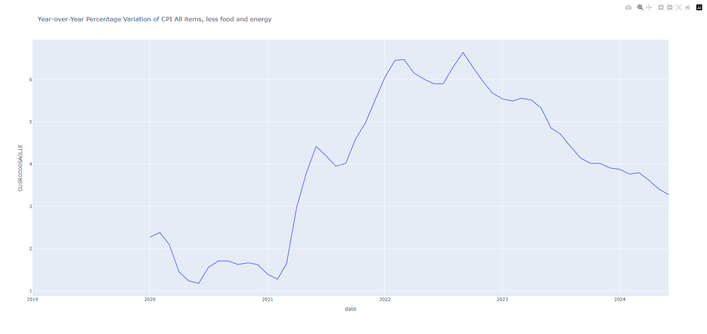
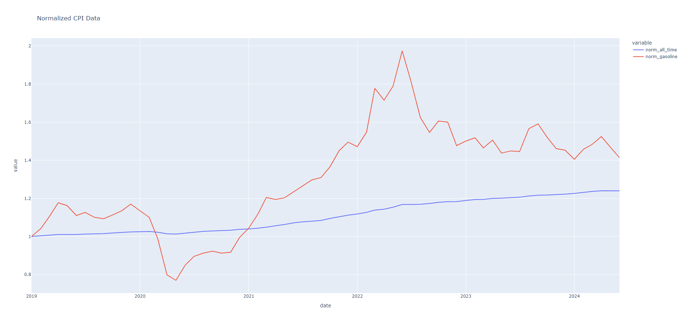

## Q2:

## Q3:
How you would automate the process of extracting the data?

To automate the process of extracting the data we could have 2 simple scripts:

1: Create a script/routine to fetch the data from the API and save it to a CSV file every hour/day/week/month (just like q1.py).
The data to be fetched (determined series) can be defined in a configuration file.
Note: The API fetching process is already simple and automatic, so we can just schedule the script to run on a regular basis.

2: Create another script/routine to process the saved CSV and upload the data to a database.
This code could also provide some extra features like:
- saving/calculating the year-over-year percentage variation,
- plotting the data and saving the plot as an image,
- writing a report with the data and the plot.

## Q4:

Explain how you would relate the price series (All items) with the Gasoline (Gasoline) price series.:

To analyse the relationship between CPI All items and CPI Gasoline price series in a simples way, we could do the following:
1. correlation analysis (linear and year-over-year percentage variation):
   - Linear correlation help to understand the direct relationship between the two datasets over time.
   - Year-over-year percentage variation correlation allows to identify how the growth rate of all items prices is related to the growth rate of gasoline prices.
2. plot to do a visual analysis:
   - Plotting the data may provide a visual view of the relationship between the two time series.
3. compare statistics like standard deviation:
   - Comparing the standard deviation of the two datasets can give an idea of how volatile both prices are over time.